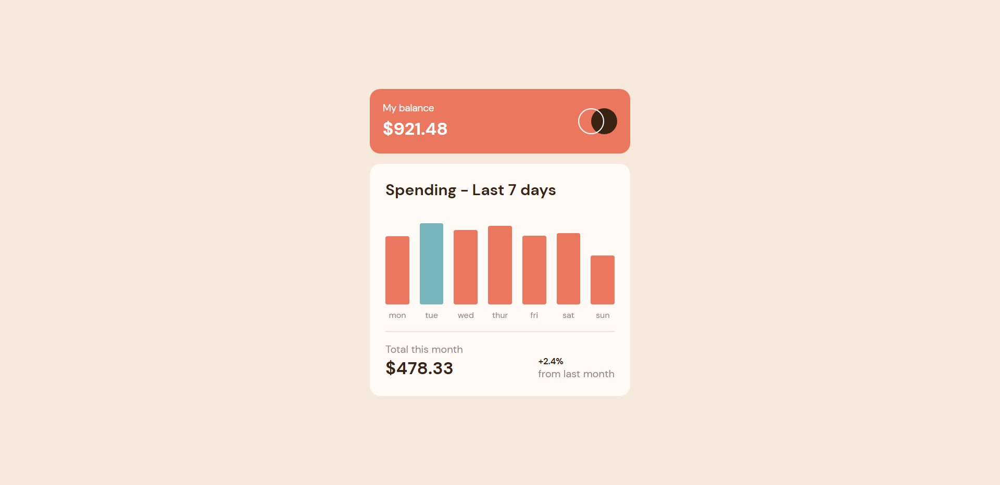

# Frontend Mentor - Expenses chart component solution

This is a solution to the [Expenses chart component challenge on Frontend Mentor](https://www.frontendmentor.io/challenges/expenses-chart-component-e7yJBUdjwt). Frontend Mentor challenges help you improve your coding skills by building realistic projects. 

## Table of contents

- [Overview](#overview)
  - [The challenge](#the-challenge)
  - [Screenshot](#screenshot)
  - [Links](#links)
- [My process](#my-process)
  - [Built with](#built-with)
  - [What I learned](#what-i-learned)
  - [Continued development](#continued-development)

## Overview

### The challenge

Users should be able to:

- View the bar chart and hover over the individual bars to see the correct amounts for each day
- See the current day’s bar highlighted in a different colour to the other bars
- View the optimal layout for the content depending on their device’s screen size
- See hover states for all interactive elements on the page
- **Bonus**: Use the JSON data file provided to dynamically size the bars on the chart

### Screenshot

### Links

- Solution URL: [Solution URL](https://github.com/K4UNG/project-24-expense-chart-frontendmentor)
- Live Site URL: [Live URL](https://k4ung24.netlify.app)

## My process

### Built with

- Semantic HTML5 markup
- CSS custom properties
- Flexbox
- CSS Grid
- Mobile-first workflow
- [React](https://reactjs.org/) - JS library

### What I learned

It's been quite a while since I last touched a line of code and this challenge helped me revise some of the core react concepts. This challenge was a bit unexpectedly hard but I managed to come up with a clean solution. I also added some animations and splitted the cash into 7 random amounts for some extra challenge. Overall, this was a really great challenge and I had a great time finishing it.

### Continued development

I will now continue my study plans as usual and I plan to dive deeper into react and learn a framework like Next in the upcoming days.